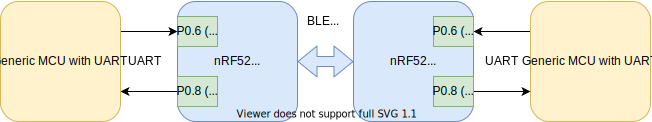
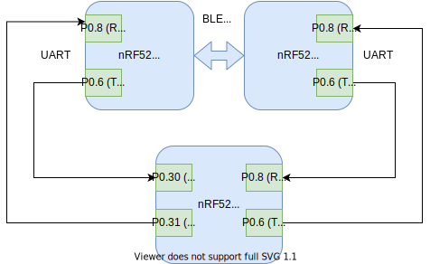

# nrf-ble-uart-low-latency-bridge
## System overview

This repository demonstrates how the nRF52-series can be used be as a UART/BLE bridge, with low latency.
The FW provided in this repository is based on examples from the nRF SDK v16.0.0
* ble_app_uart example for the nRF52 BLE Peripheral
* ble_app_uart_c example for the nRF52 BLE Central
* libuarte example for UART handling, and the nRF 52 round trip time tester (see below)

Hardware flow control is not used for UART handling.
The system currently uses baudrate 250000, but this could be tuned based what partner UART device supports. The nRF52 supports up to 1M baud. 

## Tune to increase performance
This setup is not battery optimized, nor fully latency optimized. To reduce latency further it is posible to increase the baudrate, one could also concider to include HW flow control to increase response time instead of the libuarte async timeout. 

To inrease performance even slightly more, disable logging in the projects sdk_config.h
```
#define NRF_LOG_ENABLED 0
```



## Test system latency
This repository includes a round trip time test code based on the libuarte example from the nRF SDK v16.0.0. This FW is tested with the nRF52840, built with Segger Embedded Studio.

The tester transmits 100 messages, each containing 100 bytes, in both directions. A timestamp is included in the message which is used to calculate the round trip time for each message. After 100 messages are sent in both directions, the average round trip time is reported reported through the logging module.

Real Time Transfer (RTT) is used as logging backend. The logs provides status of number of messages that were transmitted around the system OK and their round trip time. The averarge round trip time in both directions are calculated.




## Build FW
To build the projects with nRF SDK16.0.0, place this repo two folder levels below the sdk_root level.
```
sdk_root/my_projects/nrf-ble-uart-low-latency-bridge/ble_app_uart/
sdk_root/my_projects/nrf-ble-uart-low-latency-bridge/ble_app_uart_c/
sdk_root/my_projects/nrf-ble-uart-low-latency-bridge/libuarte/
```

## Supported devices and IDEs
The FW is in its current shape only tested with the nRF52832 as the UART/BLE bridges, and with the nRF52840 for the UART Round Trip Time tester. It should be possible to use all nRF52 devices for the UART/BLE bridges, with different SoftDevices. 

| Project                | Device   | SoftDevice | IDE          |
| -----------------------|----------|------------|--------------|
| BLE Peripheral         | nRF52832 | s132       | SES and Keil |
| BLE Central            | nRF52832 | s132       | SES and Keil |
| Round Trip Time tester | nRF52840 |            | SES          |

### Add support for other devive/IDE
To add support for another device or IDE, please copy the project files from the respective SDK example and update the following.

#### Include the listed files and paths:
Paths:
```
.\..\..\..\..\..\components\libraries\libuarte\
..\..\..\..\..\..\components\libraries\queue
```
Files
```
..\..\..\..\..\..\components\libraries\libuarte\nrf_libuarte_async.c
..\..\..\..\..\..\components\libraries\libuarte\nrf_libuarte_drv.c
..\..\..\..\..\..\components\libraries\queue\nrf_queue.c

..\..\..\..\..\..\modules\nrfx\drivers\src\nrfx_timer.c
..\..\..\..\..\..\modules\nrfx\drivers\src\nrfx_ppi.c
```
#### Remove files from project:
* Remove all existing UART c-files, e.g. nrf_drv_uart.c, app_uart_fifo.c
* Remove retarget.c

#### Upadate the sdk_config.h if needed with the following:
```
NRFX_TIMER_ENABLED 1
NRFX_TIMER1_ENABLED 1
NRFX_TIMER2_ENABLED 1
NRFX_TIMER3_ENABLED 1
NRFX_TIMER_DEFAULT_CONFIG_BIT_WIDTH 3
```
* Remove old legacy NRF_TIMER

```
NRFX_PPI_ENABLED 1
```
* Remove old legacy NRF_PPI

```
NRF_QUEUE_ENABLED 1
```
```
NRF_LIBUARTE_ASYNC_WITH_APP_TIMER 0
NRF_LIBUARTE_DRV_HWFC_ENABLED 0
NRF_LIBUARTE_DRV_UARTE0 1
```
```
UART_ENABLED 0
APP_UART_ENABLED 0
NRFX_UART_ENABLED 0
NRFX_UARTE_ENABLED 0
```

If it still doesn't compile, please diff your sdk_config.h against the ones from the tested setups. 